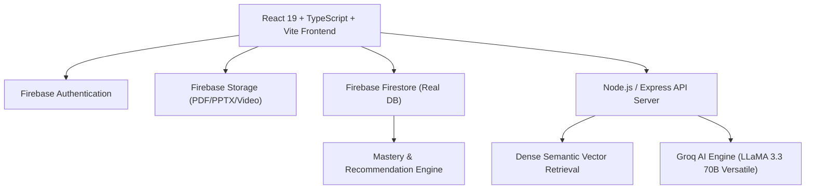
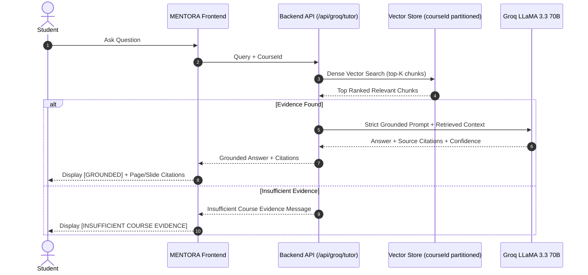
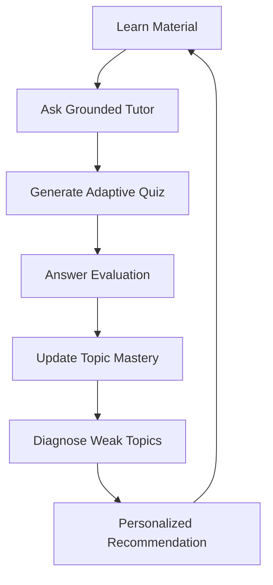

# MENTORA AI — A Multimodal, Source-Grounded & Adaptive AI Learning Companion

> **Tagline:** Learn. Adapt. Master.  
> **Hackathon Track:** Personalized Tutoring & Adaptive Learning  
> **Repository:** [https://github.com/sabeeshvar/MENTORA-AI.git](https://github.com/sabeeshvar/MENTORA-AI.git)

---

## 1. Project Overview & Problem Statement
Modern students often struggle with passive, fragmented study tools that fail to personalize explanations, hallucinate facts, or lack connection to actual course syllabi. When students ask questions to standard generic chatbots, answers are ungrounded, lack exact textbook page citations, and cannot adapt to individual learner mastery.

**MENTORA AI** solves this by turning raw course learning materials (PDF textbooks, PPT/PPTX slides, and lecture video transcripts) into a source-grounded, adaptive learning companion. Every answer is bound strictly to course context with verified page numbers, slide indices, and video timestamps. Real-time quiz evaluations continuously update topic-level mastery in Firebase Firestore and prescribe data-driven personalized recommendations.

---

## 2. Core Solution & Features
- **Multimodal Learning Material Processing:** Ingestion pipeline preserving page numbers, slide indices, and video timestamps.
- **Source-Grounded AI Tutor:** Bounded RAG inference using Groq LLaMA 3.3 70B with visible `GROUNDED` or `INSUFFICIENT COURSE EVIDENCE` status.
- **Adaptive Quiz Generation:** Generates MCQ, Short Answer, and Numerical questions directly supported by retrieved course chunks.
- **Pedagogical Wrong Answer Remedies:** Immediate 6-point breakdown (correct concept, why incorrect, simple explanation, concrete example, source citation, follow-up question) and interactive buttons (*Explain Simply*, *Give an Example*, *Ask Me a Follow-up*).
- **Mastery Engine:** Dampened exponential scoring tracking topic-level mastery across *Needs Attention* (0–39%), *Developing* (40–69%), *Good* (70–84%), and *Mastered* (85–100%).
- **Interactive Course Knowledge Map:** Hierarchical tree (`Course -> Module -> Topic -> Subtopic -> Concept`) with node inspection and direct adaptive study actions.
- **Personalized Recommendations:** Data-driven study prescriptions (*REVISION*, *QUIZ*, *READ*, *PRACTICE*, *ADVANCE*) with actual learner diagnostics.
- **Real Progress Analytics:** Un-fabricated live Firebase metrics for mastery curves, quiz accuracy, and activity streaks.
- **Hackathon Demo Mode:** Clearly labelled toggle preloaded with demo course data for judges to test the complete 3–5 minute loop instantly.

---

## 3. High-Level System Architecture



---

## 4. Multimodal Document Processing Pipeline


---

## 5. Retrieval-Augmented Generation (RAG) Architecture



---

## 6. Adaptive Learning Loop



---

## 7. Firebase Firestore Schema

- `users/{uid}`: Profile, authentication identity, streak, and aggregate stats.
- `courses/{courseId}`: Course title, subject, ownerId, metadata.
- `courses/{courseId}/materials/{materialId}`: Uploaded file records and status.
- `courses/{courseId}/materials/{materialId}/chunks/{chunkId}`: Knowledge chunks with `pageNumber`, `slideNumber`, `startTimestamp`, `endTimestamp`.
- `users/{uid}/mastery/{topicId}`: Topic mastery score (0.0 to 1.0), attempts, errors, trend, difficulty level.
- `users/{uid}/quizAttempts/{attemptId}`: Completed quiz score, accuracy %, timestamp, detailed results.
- `users/{uid}/recommendations/{recId}`: Active personalized learning recommendations.
- `quizzes/{quizId}`: Generated grounded quiz definitions.

---

## 8. Technology Stack

- **Frontend:** React 19, TypeScript, Vite, Tailwind CSS v4, React Router v7, Lucide React
- **Backend:** Node.js, Express, TypeScript (`tsx`)
- **AI Inference:** Groq SDK (`llama-3.3-70b-versatile`)
- **Database & Auth:** Firebase Firestore, Firebase Authentication, Firebase Storage
- **Security:** `firestore.rules`, `storage.rules`, Server-side Groq API key isolation

---

## 9. Local Development Setup

### Prerequisites
- Node.js (v18+)
- npm or yarn
- Groq API Key ([console.groq.com](https://console.groq.com))
- Firebase Project configuration

### 1. Clone Repository & Install Dependencies
```bash
git clone https://github.com/sabeeshvar/MENTORA-AI.git
cd MENTORA-AI
npm install
```

### 2. Configure Environment Variables
Create `.env` using `.env.example`:
```env
# Client - Firebase Web Configuration
VITE_FIREBASE_API_KEY=your_firebase_api_key
VITE_FIREBASE_AUTH_DOMAIN=your-app.firebaseapp.com
VITE_FIREBASE_PROJECT_ID=your-project-id
VITE_FIREBASE_STORAGE_BUCKET=your-app.appspot.com
VITE_FIREBASE_MESSAGING_SENDER_ID=your_sender_id
VITE_FIREBASE_APP_ID=your_app_id
VITE_API_BASE_URL=http://localhost:5000/api

# Backend Server Configuration
PORT=5000
NODE_ENV=development
GROQ_API_KEY=gsk_your_groq_api_key_here
```

### 3. Run Development Servers
Start backend API server:
```bash
npm run server
```

In a separate terminal, start frontend:
```bash
npm run dev
```

---

## 10. Automated Testing & Verification

Run end-to-end pipeline test:
```bash
npx tsx scripts/test-e2e-pipeline.ts
```

Run dense vector semantic RAG retrieval test:
```bash
npx tsx scripts/test-rag-pipeline.ts
```

Run TypeScript compilation check:
```bash
npm run lint
```

Build production bundle:
```bash
npm run build
```

---

## 11. Security & Prompt Injection Defense
- **API Key Isolation:** Groq API keys remain strictly server-side.
- **Context Separation:** System instructions, retrieved context, and student questions are partitioned in system/user message blocks.
- **Course Isolation:** Retrieval queries are strictly scoped to the active `courseId`.
- **Firebase Security Rules:** Defined in `firestore.rules` and `storage.rules` preventing unauthorized cross-user access.

---

## 12. 3–5 Minute Hackathon Demo Flow
1. **Landing Page:** Review the 6 core pillars and click **Explore Demo**.
2. **Dashboard:** Toggle **DEMO MODE [ON]** to inspect preloaded course *CS 452: Distributed Systems*.
3. **Knowledge Map (`/knowledge-map`):** Inspect the hierarchy (*Course -> Module -> Topic -> Concept*), view source citations, and check topic mastery.
4. **AI Tutor (`/tutor`):** Ask *"How does Raft leader election prevent split votes?"* and observe the verified `GROUNDED` response with page citations.
5. **Adaptive Quiz (`/quiz`):** Click **Generate Adaptive Quiz** or take an existing quiz; answer questions and test the 6-point wrong-answer remediation with *"Explain Simply"*.
6. **Mastery & Analytics (`/progress`):** Observe live mastery update and review personalized recommendations.
