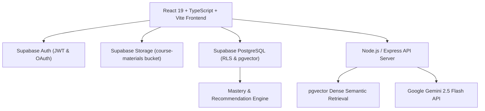

# MENTORA AI — Multimodal, Source-Grounded & Adaptive AI Learning Companion

> **Tagline:** Learn. Adapt. Master.  
> **Hackathon Track:** Multimodal AI Hackathon 2026 — Track D: Personalized Tutoring & Adaptive Learning  
> **Architecture:** Google Gemini 2.5 Flash + Supabase (PostgreSQL, Row Level Security, pgvector, Auth, Storage)  
> **Repository:** [https://github.com/sabeeshvar/MENTORA-AI.git](https://github.com/sabeeshvar/MENTORA-AI.git)

---

## 1. Project Overview & Problem Statement
Modern students often struggle with passive, fragmented study tools that fail to personalize explanations, hallucinate facts, or lack connection to actual course syllabi. When students ask questions to standard generic chatbots, answers are ungrounded, lack exact textbook page citations, and cannot adapt to individual learner mastery.

**MENTORA AI** solves this by turning raw course learning materials (PDF textbooks, PPT/PPTX slide decks, diagrams, and lecture video transcripts) into a source-grounded, adaptive learning companion. Every answer is bound strictly to course context with verified page numbers, slide indices, diagram labels, and video timestamps. Real-time quiz evaluations continuously update topic-level mastery in Supabase PostgreSQL and prescribe data-driven personalized recommendations, personalized study plans, and spaced repetition revision.

---

## 2. Core Solution & Features

- **Multimodal Material Ingestion:** Ingests PDF textbooks, PowerPoint slide decks (PPT/PPTX), diagrams, and lecture video transcripts, preserving exact page numbers, slide numbers, and video timestamps.
- **Source-Grounded AI Tutor:** Bounded RAG inference using **Google Gemini 2.5 Flash** with visible `GROUNDED` or `INSUFFICIENT COURSE EVIDENCE` status.
- **Adaptive Quiz Engine:** Generates MCQ, Short Answer, and Numerical questions directly supported by retrieved course chunks with diagnostic assessment modes.
- **Misconception Analysis & Pedagogical Wrong-Answer Remedies:** Immediate 6-point pedagogical breakdown (correct concept, why incorrect, simple explanation, concrete example, source citation, follow-up question) and interactive buttons (*Explain Simply*, *Give an Example*, *Ask Me a Follow-up*).
- **Topic Mastery Model:** Dampened exponential scoring tracking topic-level mastery across *Needs Attention* (0–39%), *Developing* (40–69%), *Good* (70–84%), and *Mastered* (85–100%).
- **Personalized Study Plan Engine:** 6-step personalized schedule generation factoring in target exam dates, available daily study minutes, preferred days, weak topics, and mastery curves.
- **Spaced Repetition Revision Engine:** Leitner-style spaced repetition tracking 4 distinct topic status buckets (*Due Today*, *Overdue*, *Upcoming*, *Mastered*) with interactive guided revision sessions and targeted diagnostic recaps.
- **Multilingual Learning Experience:** Native learning support across 8 languages (**English, Tamil, Hindi, Telugu, Malayalam, Kannada, Bengali, Marathi**) for the AI tutor, quizzes, study plans, revision, and recommendations while strictly preserving canonical source metadata.
- **Interactive Course Knowledge Map:** Hierarchical tree (`Course -> Module -> Topic -> Concept`) with node inspection and direct adaptive study actions.
- **Empirical Evaluation & Benchmarking:** Built-in evaluation dashboard benchmarking groundedness, citation accuracy, answer relevance, and misconception detection across simulated learners (Novice, Developing, Advanced).

---

## 3. High-Level System Architecture



---

## 4. Supabase Relational Database Schema

The database is built on PostgreSQL with UUID primary keys, foreign keys, timestamps, indexes, and Row Level Security (RLS) enabled on all user-owned tables.

- `profiles`: User account details, display name, role, learning stats, preferred language.
- `courses`: Course definitions, subjects, owner ID, and material counters.
- `course_materials`: Metadata for uploaded PDFs, PPTXs, and videos referencing Supabase Storage paths.
- `course_chunks`: Semantic multimodal chunks with `page_number`, `slide_number`, `video_timestamp`, `diagram_description`, and `pgvector` embeddings.
- `course_topics`: Extracted syllabus topics and concept hierarchies.
- `quizzes`: Generated grounded quiz definitions and questions.
- `quiz_attempts`: Detailed quiz attempt records, question-level scores, accuracy, and diagnostic flags.
- `mastery`: Per-topic learner mastery scores (0.0 to 1.0), attempt counts, trend, and difficulty.
- `study_plans`: Personalized multi-day study schedules generated for target dates.
- `study_plan_tasks`: Daily milestone tasks linked to courses and topics.
- `revision_items`: Spaced repetition revision intervals, review counts, next due dates, and weak areas.
- `recommendations`: Adaptive data-driven learning prescriptions.
- `evaluation_results`: Track D empirical evaluation benchmark metrics.

---

## 5. Technology Stack

- **Frontend:** React 19, TypeScript, Vite, Tailwind CSS v4, React Router v7, Lucide React
- **Backend:** Node.js, Express, TypeScript (`tsx`)
- **AI Inference:** Google Gemini 2.5 Flash (`@google/genai`)
- **Database & Auth:** Supabase PostgreSQL, Supabase Auth, Supabase Storage (`@supabase/supabase-js`)
- **Vector Search:** PostgreSQL + `pgvector` dense vector indexing
- **Security:** Supabase Row Level Security (RLS) policies, server-side secret isolation

---

## 6. Environment Variables Configuration

Copy `.env.example` to `.env`:

```bash
cp .env.example .env
```

### Environment Variable Roles & Permissions

| Variable Name | Safe for Frontend? | Server Only? | Description |
|:---|:---:|:---:|:---|
| `GEMINI_API_KEY` | ❌ **NO** | ✅ **YES** | Google Gemini API key. Never expose in client code. |
| `VITE_SUPABASE_URL` | ✅ **YES** | — | Public Supabase project URL for the client. |
| `VITE_SUPABASE_ANON_KEY` | ✅ **YES** | — | Public Supabase anonymous API key for the client. |
| `SUPABASE_URL` | ❌ NO | ✅ **YES** | Backend connection URL to Supabase project. |
| `SUPABASE_ANON_KEY` | ❌ NO | ✅ **YES** | Backend anon key for authenticated user proxying. |
| `SUPABASE_SERVICE_ROLE_KEY` | ❌ **CRITICAL NO** | ✅ **YES** | Elevated service role key for trusted server operations. |
| `VITE_API_BASE_URL` | ✅ **YES** | — | API base URL for client fetch requests (`/api`). |
| `PORT` | ❌ NO | ✅ **YES** | Express server listen port (default: `5000`). |

---

## 7. Setup & Installation Guide

### Prerequisites
- Node.js (v18 or higher)
- npm (v9 or higher)
- Google Cloud / Google AI Studio Account for Gemini API Key
- Supabase Account for PostgreSQL, Auth, and Storage

### Step 1: Obtain Google Gemini API Key
1. Go to [Google AI Studio](https://aistudio.google.com/apikey).
2. Click **Create API Key** and copy the generated key.
3. Add it to your server `.env` as `GEMINI_API_KEY`.

### Step 2: Set Up Supabase Project
1. Create a project at [supabase.com](https://supabase.com).
2. Go to **Project Settings -> API** and copy:
   - **Project URL** -> `SUPABASE_URL` and `VITE_SUPABASE_URL`
   - **anon public key** -> `SUPABASE_ANON_KEY` and `VITE_SUPABASE_ANON_KEY`
   - **service_role key** -> `SUPABASE_SERVICE_ROLE_KEY` (Backend only)
3. Navigate to **SQL Editor** in Supabase and run the migration script:
   - File: `supabase/migrations/001_initial_schema.sql`
   - This enables `pgvector`, creates all 13 relational tables, sets up foreign keys, and configures Row Level Security.
4. Navigate to **Storage** in Supabase:
   - Create a bucket named `course-materials`.
   - Set visibility to public read or authenticated read according to your deployment policy.

### Step 3: Install Dependencies
```bash
npm install
```

### Step 4: Run Development Servers
Start the backend Express server:
```bash
npm run server
```

In a separate terminal, start the Vite frontend development server:
```bash
npm run dev
```

Open `http://localhost:5173` in your browser.

---

## 8. Automated Testing & Verification

Run the end-to-end pipeline test:
```bash
npx tsx scripts/test-e2e-pipeline.ts
```

Run dense vector semantic RAG retrieval test:
```bash
npx tsx scripts/test-rag-pipeline.ts
```

Run TypeScript compilation check:
```bash
npm run lint
```

Run production build:
```bash
npm run build
```

---

## 9. Security Architecture & Isolation

- **Zero-Secret Client Bundles:** `GEMINI_API_KEY` and `SUPABASE_SERVICE_ROLE_KEY` are read exclusively in Node.js server services. They are never imported or referenced in frontend components.
- **Database Row Level Security:** Every query to user-owned data (`profiles`, `mastery`, `quiz_attempts`, `study_plans`, `revision_items`, `recommendations`) enforces `auth.uid() = user_id`.
- **Course Isolation:** RAG chunk retrieval queries are strictly filtered by the authorized student's `course_id`.
- **Prompt Injection Defense:** Model system prompts clearly isolate trusted course context from user query inputs, requiring strict citation matching and refusal when context is missing.

---

## 10. 3–5 Minute Hackathon Demo Walkthrough

1. **Dashboard & Language:** Open `/dashboard`. Choose your preferred Indian language (e.g., Tamil, Hindi, Telugu) from the language selector in the top bar.
2. **Demo Mode:** Toggle **DEMO MODE [ON]** to inspect preloaded course *CS 452: Distributed Systems*.
3. **Course Knowledge Map (`/knowledge-map`):** Inspect the hierarchical topic tree, view chunk citations, and examine topic mastery states.
4. **AI Tutor (`/tutor`):** Ask *"How does Raft leader election prevent split votes?"* in your selected language and observe the verified `GROUNDED` response with exact page citations.
5. **Study Plan (`/study-plan`):** Generate a 6-step personalized schedule targeting an upcoming exam date.
6. **Spaced Repetition (`/revision`):** Review the 4 revision buckets and launch a guided revision session for weak topics.
7. **Adaptive Quiz (`/quiz`):** Take a grounded quiz and test the 6-point wrong-answer remediation with *"Explain Simply"*.
8. **Mastery Analytics (`/progress`):** Observe live mastery update across topics and review personalized recommendations.
9. **Evaluation Benchmarks (`/evaluation`):** Inspect empirical RAGAS & TruLens evaluation metrics and simulated learner distributions.
